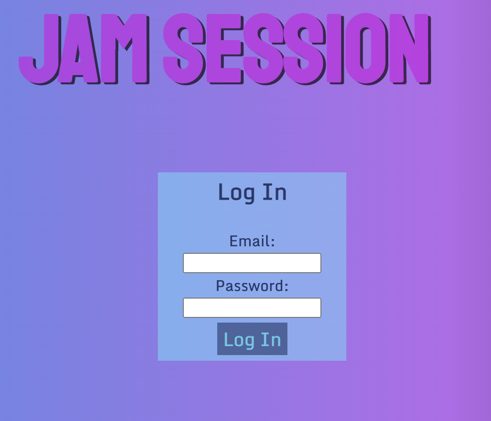
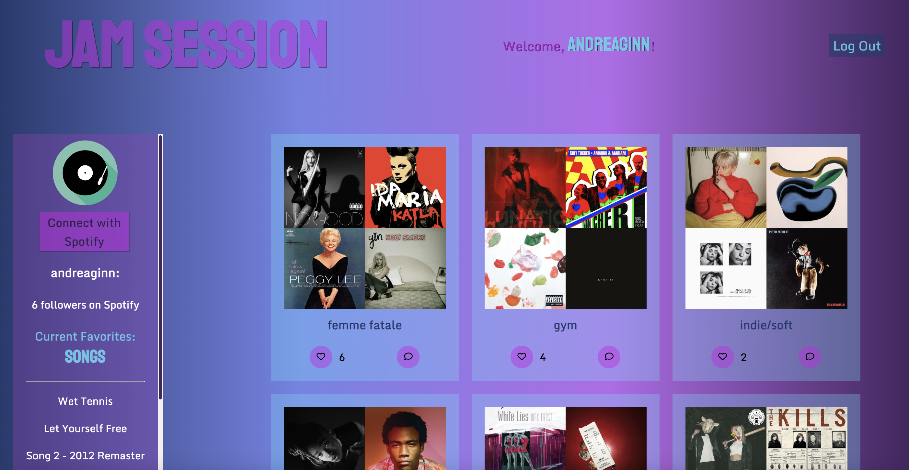
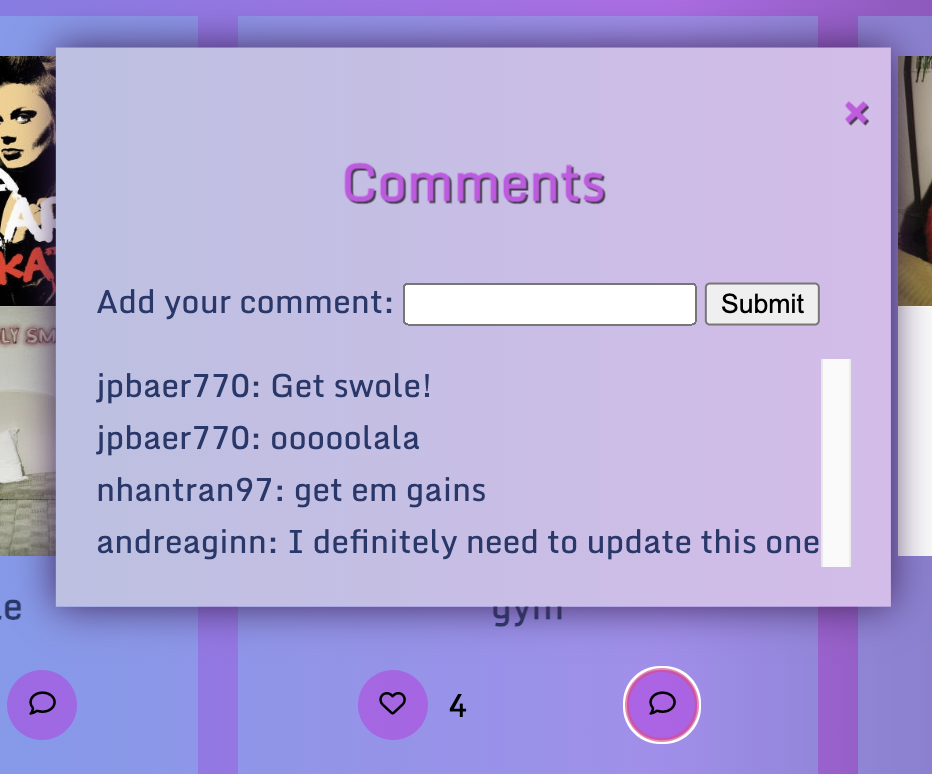

# Jam Session
## Description

A music social media site that connects to the Spotify API and allows users to create a profile where they can display all of the current songs they're listening to. A homepage will display the most recent posts from all users.

## User Story

AS a music lover, 
I WANT to be able to share the songs I currently have on repeat with my friends and have access to theirs, 
SO THAT we can continue to grow our personal music collection and discover new artists. 

# How to Use Jam Session

Here are step-by-step instructions for using the Jam Session website features.

## How To's
1. Go to the Jam Session [homepage](https://calm-tor-47120.herokuapp.com/). Sign up for a Jam Session account by clicking 'New to Jam Session' on the homepage.

2. Log into Jam Session with your email and your password.

3. Explore your Jam Session profile! You can view your top artist, your top songs, and your top playlists. Click on the links to visit your Spotify account. 

4. Click the heart icon to favorite an album. Click on the speech bubble to leave a comment on an album!

# Troubleshooting

Contact our team at our GitHub profiles for technical assistance.

# Technology Used

We used the following technologies for this website.

| Tech         | Description |
| ----------- | ----------- |
| HTML, CSS | Styling languages for the front end |
| [Node.JS](https://nodejs.org/) | Cross-platform, open-source server environment |
| [Express](https://expressjs.com/) | Node.js web app framework |
| [Handlebars](https://handlebarsjs.com/) | This is a templating language that generates HTML or other text formats|
| [Spotify API](https://developer.spotify.com/documentation/web-api) | API that enables applications to interact with Spotify services. |
| [Nodemon](https://nodemon.io/) | Nodemon monitors changes in the source and can automatically restart the server |
| [Axios](https://axios-http.com/docs/intro) | A promise-based HTTP Client for node.js and the browser |

# Google Presentation

* View the [Google Slides Presentation](https://docs.google.com/presentation/d/1vbhPHD9AaEPcAyOnbZTBgbbWz4rvekkTRhu-PMlJ7jg/edit#slide=id.p). ✨

# Credits 

| Developers         | GitHub Profile|
| -----------  | ----------- |
|Jorgen Baertsch | [JpBaer](https://github.com/JpBaer)  |
|Andrea Ginn |[andreaginn](https://github.com/andreaginn)
|Christy Hanson |[ChristyGHanson](https://github.com/ChristyGHanson) |
|Nhan Tran |[nathantr97](https://github.com/nathantr97)